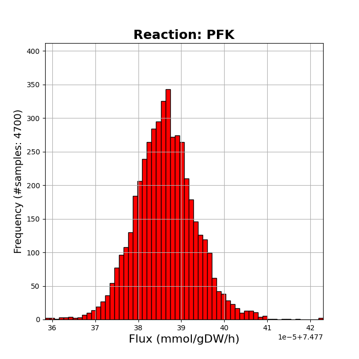
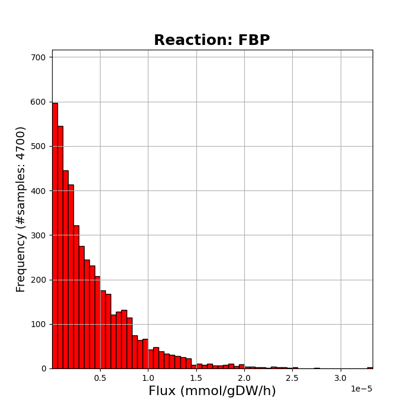
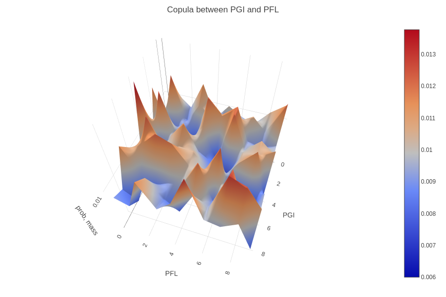
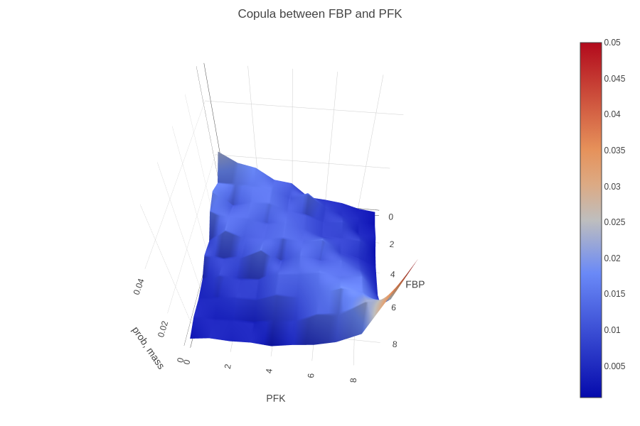
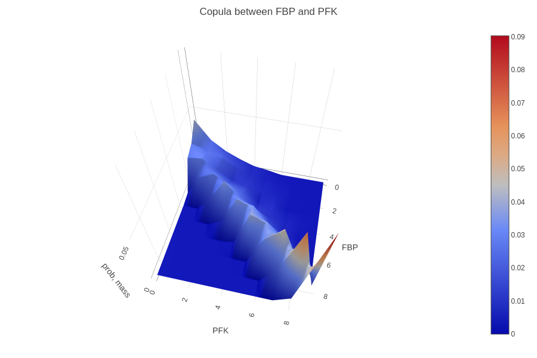

# Notes on the steady-state assumption in metabolic networks

## The steady-states assumption

A steady state is an equilibrial condition in a dynamic process in which the rate of input of a state variable is equal to the rate of output of that variable.
For a metabolic pathway at steady state, the rate of input into the pathway, the rate of conversion of metabolite A to B and the rate of output are all equal.

When we analyze a metabolic network and obtain reactions fluxes, we get the fluxes in the steady-state condition.

If we change a reaction's flux, then we also alter the concentration of other metabolites in the system.
These metabolites must find a way to return to the original steady state or settle to a new one.

Thus, specific pathways are activated that increase or decrease the concentration of these metabolites.

## Correlated reactions

Flux sampling is an unbiased method to analyze the possible states of a metabolic network.
Sampling returns a numeric matrix as output with the flux distribution of each reaction in each row.
A histogram of a flux distribution can be seen in the figure below:

Statistical analysis of fluxes distributions can give insights on whether pairwise reactions are correlated or not.
This can be done with a pearson correlation coefficient.

Certain reactions have distributions with very low flux values. Their mean flux value is close to 0 and they have a low variance value too.
An example of this, is the distribution of the `FBP` reaction when sampling under the optimal conditions:

Correlation tests that compare this distribution with the rest are nonsense and they may produce false information.
So we can identify this type of distributions and ingore them when applying correlation tests.

Another method to identify correlation between pairwise reactions is to compute their copula and graphically represent it.
A visual representation of a copula can be seen in the figure below:

Copulas show the dependence between 2 reactions fluxes.
In the figure above we see that a specific area where density is increased/decreased does not exist.
As a result, these 2 reactions are not correlated in any way.

From what is stated, by plotting copulas it is expected to identify positive, negative or no (when uniform) correlation.
However, in some cases, copulas indicate correlation only when a reaction takes its lowest or highest flux values.
An example of this type of copula is:

We observe that `PFK` takes its highest values only when `FBP` takes its highest values as well.
This can be explained by the steady-state assumption. `PFK` is a reaction that is involved in the glycolytic pathway,
whereas `FBP` is involved in glyconeogenesis. When `PFK` is highly active it consumes `D-Fructose-6-phosphate` to produce
`D-Fructose-1-6-bisphosphate`. The excessive amount of `D-Fructose-1-6-bisphosphate` satisfies the biomass needs of the cell
and thus, the remaining amount is converted back to `D-Fructose-6-phosphate` through the `FBP` to reach its steady-state concentration.

We can better understand this concept, by exploring the model behavior under sub-optimal conditions. When the cell does not prioritize biomass
production, pathways that are not directly involved to the biomass reaction have increased activity. As such, `FBP` has increased activity,
because the amount of `D-Fructose-1-6-bisphosphate` is increased too. When this happens, `PFK` and `FBP` have increased correlation
and this is depicted in their updated copula plot too:

For obvious reasons we cannot plot and inspect all possible copulas. That's why we will use a metric called copula indicator to describe the copula shape for us.
This indicator sums the density values that exist on the top-left and bottom-right corner and divides them with the sum of the rest corner values.
Thus, depending on how much positive or negative the indicator is, we get the type of correlation that exists.

